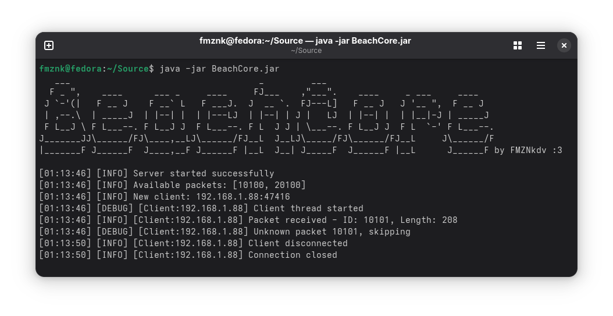

# BeachCore


A Kotlin-based emulation of the `libg.so` core library from SuperCell's Boom Beach game. This project aims to recreate the core game logic and functionality for educational and research purposes.

## Prerequisites

### Java Development Kit (JDK) 21
You'll need JDK 21 or later to build and run this project.

**Installation options:**
- **Ubuntu/Debian:** `sudo apt install openjdk-21-jdk`
- **macOS:** `brew install openjdk21`
- **Windows:** Download from [Oracle](https://www.oracle.com/java/technologies/downloads/#java21) or use [SDKMAN](https://sdkman.io/)

### Kotlin Compiler
The project requires Kotlin to compile.

**Recommended installation via Snap:**
```bash
sudo snap install kotlin --classic
```

**Alternative installation methods:**
- **SDKMAN:** `sdk install kotlin`
- **Manual:** Download from [Kotlin releases page](https://github.com/JetBrains/kotlin/releases)

## Building the Project

To compile the project into a JAR file, run:

```bash
kotlinc -include-runtime -d beachcore.jar `find src -name "*.kt"`
```

This command:
- Compiles all Kotlin source files in the `src` directory
- Includes the Kotlin runtime in the resulting JAR
- Outputs the executable JAR as `beachcore.jar`

## Running the Project

After successful compilation, execute the JAR with:

```bash
java -jar beachcore.jar
```


###### This content is not affiliated, approved, sponsored or approved specifically by Supercell and Supercell is not responsible for it. For more, see the Supercell Fan Content Policy: www.supercell.com/fan-content-policy
